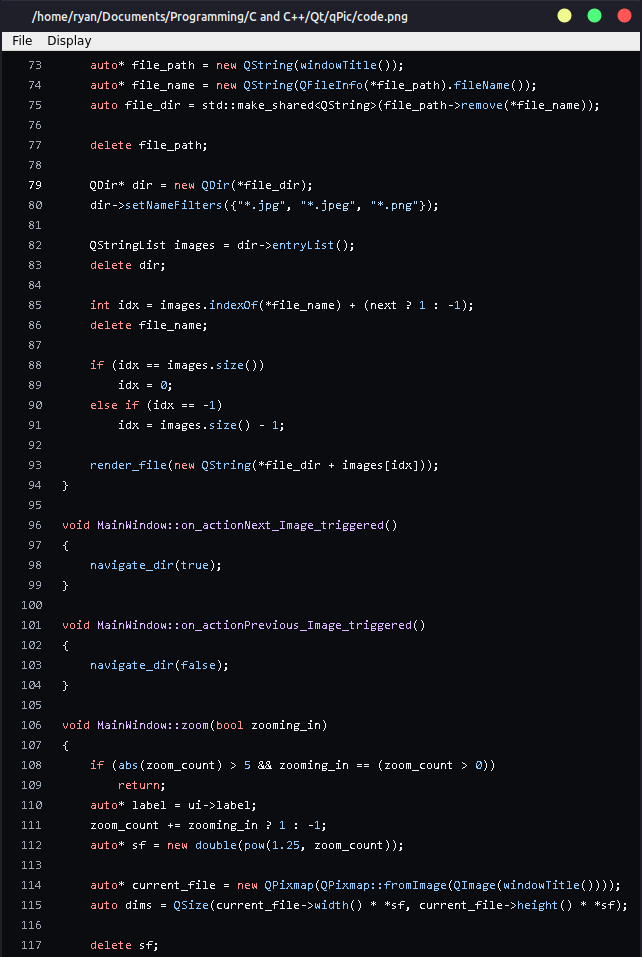

# qPic
A lightweight image viewer made in Qt

## About
qPic is an image viewer. In comparison with IrfanView, one of the most popular cross-platform image viewers, qPic is
- Free and open-source
- Nearly 30x smaller
- Modern and minimal

## Screenshots
Windows:

Xfce (Linux):

