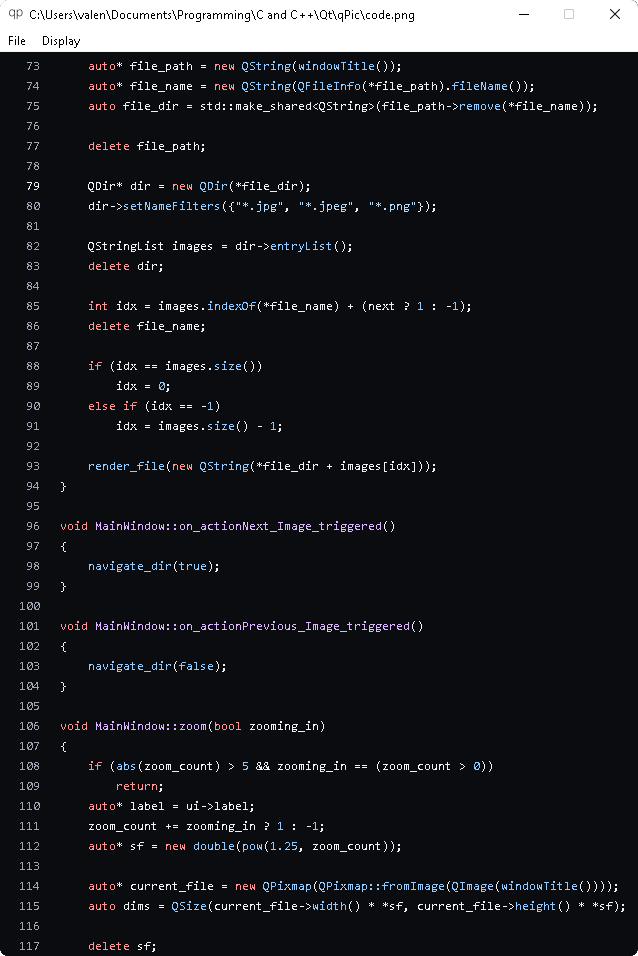

# qImg
A lightweight image viewer made in Qt

## About
qImg is an image viewer. In comparison with IrfanView, one of the most popular cross-platform image viewers, qView is
- Free and open-source
- Nearly 30x smaller
- Modern and minimal

## Screenshots

